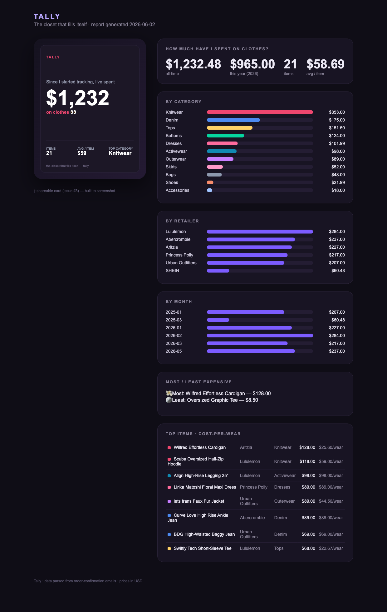

# Tally

**The closet that fills itself.** Tally auto-imports your clothing purchases so you see what you've spent, what your closet is worth to resell, and what's worth selling next — without manually cataloging a single item.

> Status: early MVP — the **ingestion → spend-mirror → shareable-card** slice runs end-to-end (see Demo). Plan in [`ROADMAP.md`](./ROADMAP.md); validation/scope rationale in [`docs/decisions/0001-scope-and-pivot.md`](./docs/decisions/0001-scope-and-pivot.md).

## Demo

Parse a folder of order-confirmation emails → a spend report + a shareable card, no manual cataloging:



The left panel is the screenshot-ready share card (issue #3); the right is the spend mirror (issue #2) built from parsed receipts (issue #1). Open [`examples/sample_report.html`](./examples/sample_report.html) for the interactive version.

## Why
- **The hook:** answer *"how much have I actually spent on clothes?"* in the first session — no manual cataloging. The closet is a byproduct of importing your purchases.
- **The moat:** a neutral, cross-platform resale-valuation + sell-through engine ("your closet is worth ~$X vs you paid $Y"), powered by your closet + cost-basis + wear data.
- **The revenue:** list unworn items out to existing marketplaces (Poshmark / Vinted / eBay) via affiliate / deep-link — riding their liquidity instead of building our own.

## Privacy
Privacy-first is a product constraint: minimal data scopes, on-device parsing where feasible, and **we never sell your spend data.**

## Develop

```bash
uv sync
uv run pre-commit install
uv run pytest

# run the demo (parses tests/fixtures/emails → demo_out/index.html + spend_card.svg)
PYTHONPATH=src uv run python -m tally --out demo_out
```

## License

Apache 2.0
