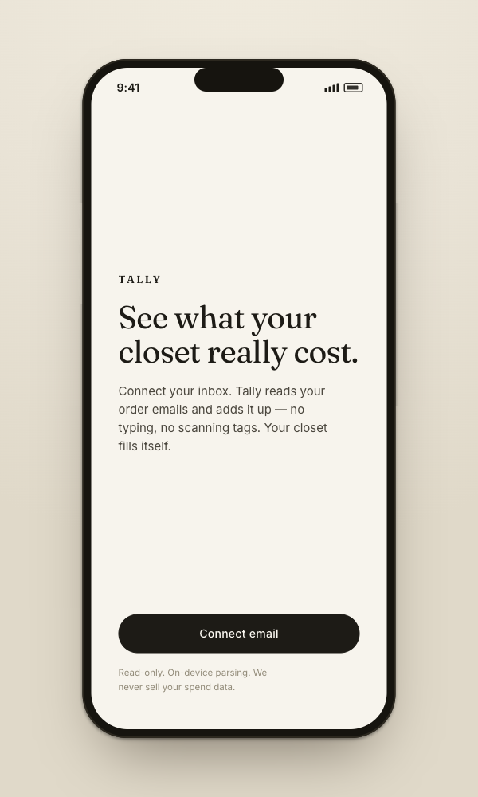
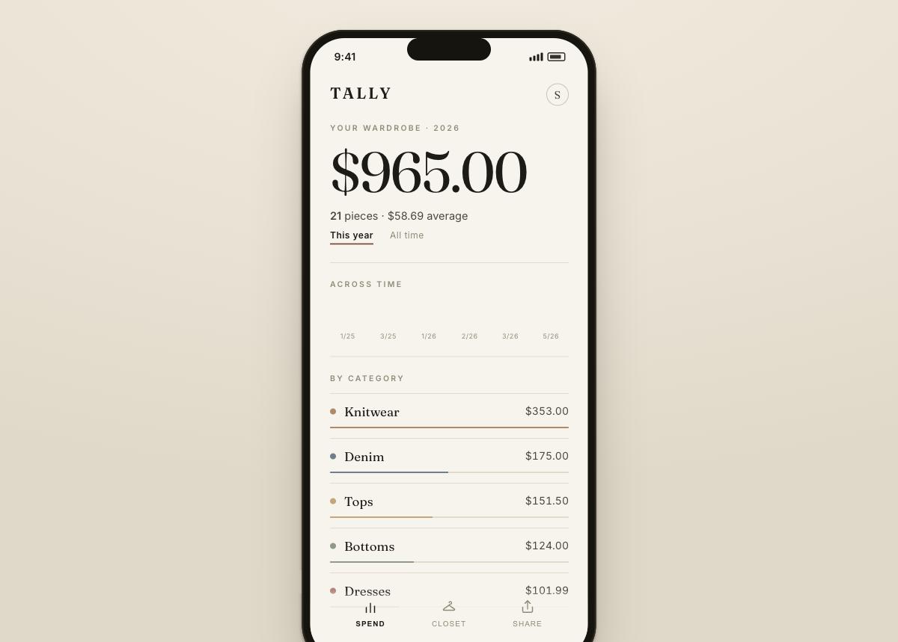
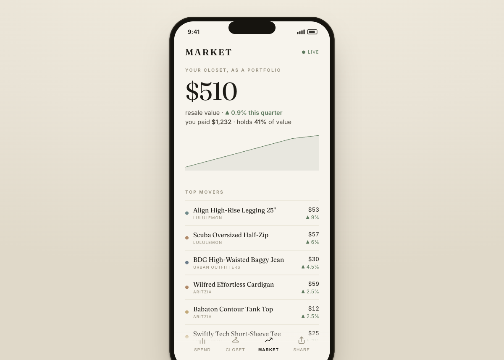
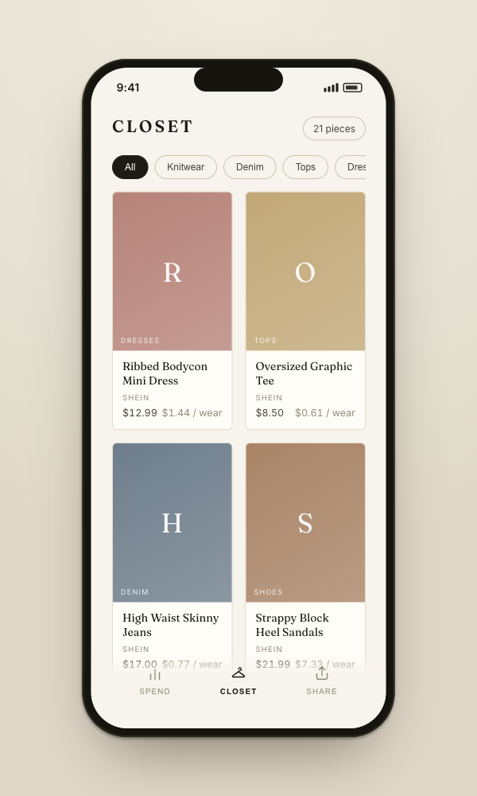
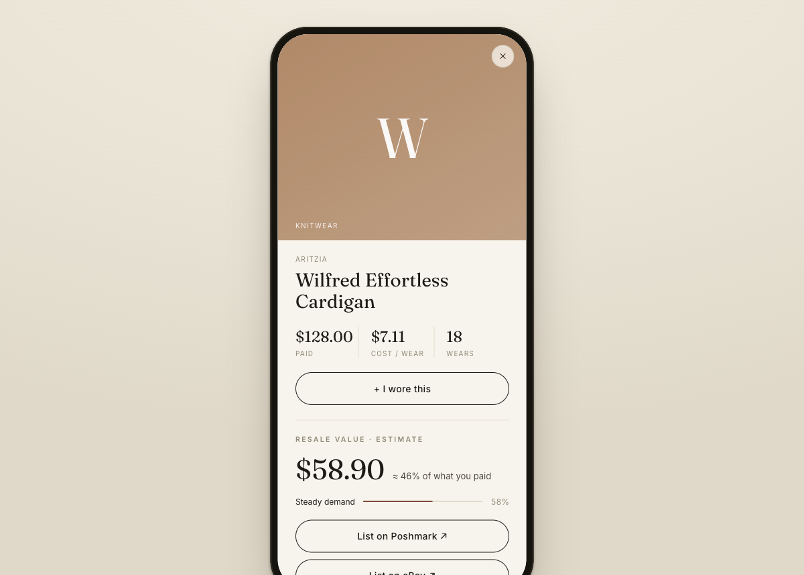
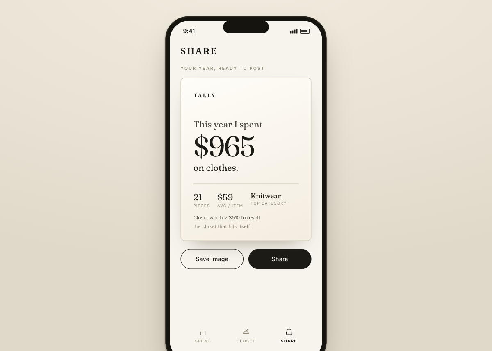

# Tally

**The closet that fills itself.** Tally auto-imports your clothing purchases so you see what you've spent, what your closet is worth to resell, and what's worth selling next — without manually cataloging a single item.

**Live:** [landing + waitlist](https://danielregaladoumiami.github.io/tally/) · [app demo](https://danielregaladoumiami.github.io/tally/app.html)

> Status: early MVP — an interactive **editorial UI prototype** (Vite + React) over a Python **ingestion → spend** pipeline. Plan in [`ROADMAP.md`](./ROADMAP.md); validation/scope rationale in [`docs/decisions/0001-scope-and-pivot.md`](./docs/decisions/0001-scope-and-pivot.md).

## Demo

**The app** — connect your inbox, and your spend + closet fill themselves. Clean editorial direction, mobile prototype:

<table>
  <tr>
    <td></td>
    <td></td>
    <td></td>
  </tr>
  <tr>
    <td align="center"><sub>Connect</sub></td>
    <td align="center"><sub>Spend reveal</sub></td>
    <td align="center"><sub>Market · closet as a portfolio</sub></td>
  </tr>
  <tr>
    <td></td>
    <td></td>
    <td></td>
  </tr>
  <tr>
    <td align="center"><sub>Closet</sub></td>
    <td align="center"><sub>Resale + sell-it</sub></td>
    <td align="center"><sub>Share card</sub></td>
  </tr>
</table>

Tap any item for **cost-per-wear**, **estimated resale value** ("≈ 46% of what you paid"), sell-through, and a one-tap **list-it-out** handoff to Poshmark/eBay — the closet→resale loop (the moat), read-only and on your terms. The **Market** tab shows your closet as a portfolio (total resale value, value-over-time, top movers) — the StockX-style hook *without* building an exchange ([why](./docs/decisions/0002-closet-as-portfolio.md)). The Share card exports as a real PNG.

Run it: `cd frontend && npm install && npm run dev` → http://127.0.0.1:5173

**The data layer** — a Python pipeline parses order-confirmation emails into the numbers behind the UI ([`src/tally`](./src/tally), 13 tests). Try it: `PYTHONPATH=src uv run python -m tally` (renders [`examples/sample_report.html`](./examples/sample_report.html)).

## Why
- **The hook:** answer *"how much have I actually spent on clothes?"* in the first session — no manual cataloging. The closet is a byproduct of importing your purchases.
- **The moat:** a neutral, cross-platform resale-valuation + sell-through engine ("your closet is worth ~$X vs you paid $Y"), powered by your closet + cost-basis + wear data.
- **The revenue:** list unworn items out to existing marketplaces (Poshmark / Vinted / eBay) via affiliate / deep-link — riding their liquidity instead of building our own.

## Privacy
Privacy-first is a product constraint: minimal data scopes, on-device parsing where feasible, and **we never sell your spend data.**

## Develop

```bash
uv sync
uv run pre-commit install
uv run pytest

# run the demo (parses tests/fixtures/emails → demo_out/index.html + spend_card.svg)
PYTHONPATH=src uv run python -m tally --out demo_out
```

## License

Apache 2.0
